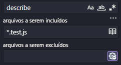

# QuickChek

Aplicativo para marcação de consultas.

## Instalação

Instale as dependências

    npm i

Para rodar a aplicação

    npm start

Acesse o endereço `localhost:9090` no seu navegador para visualizar a aplicação

## Alterando as variáveis de ambiente

Para rodar o back-end em outro endereço, renomeie o arquivo `.env.example` para `.env` e altere o valor do endereço:

    VITE_BACKEND_URL="http://localhost:8080"

## Para testar o projeto

Para realizar os testes:

    npm run test

Para obter a cobertura de testes apenas dos arquivos testados:

    npm run test:coverage

Para obter a cobertura de testes para todos os arquivos:

    npm run test:coverage:all

Para pesquisar todos os arquivos de testes, digite na barra de pesquisa do Vs Code:

    describe

E clique nos três pontos (...) para incluir arquivos terminados em:

    *.test.js

Exemplo:

## Equipe

- Flávio Raposo
- João Pedro Marinho
- José Adeilton
- Renan Leite Vieira
- Rian Vinicius
- Robério José
